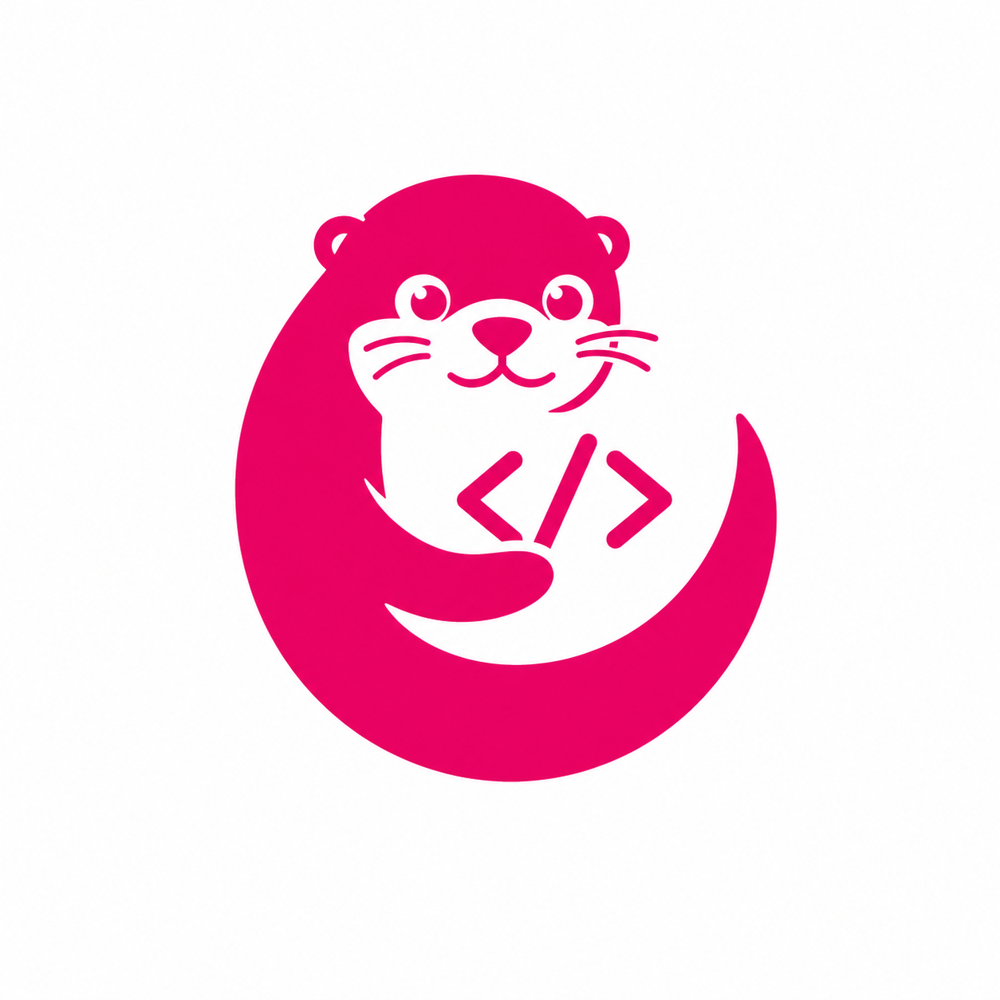
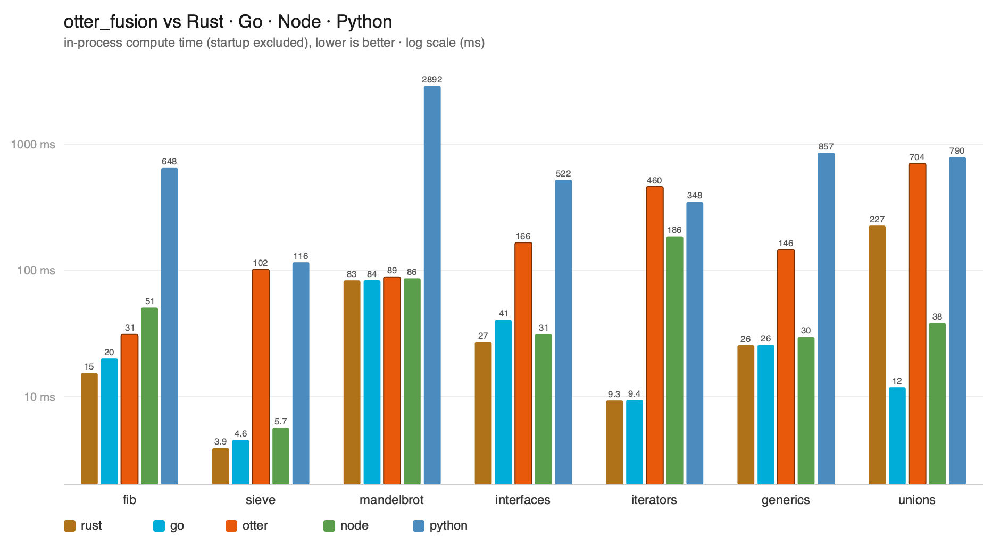

# Otter Fusion



A small statically-typed language that compiles to native code through Cranelift.
Files end in `.of`. The syntax leans on TypeScript. The semantics (implicit
returns, discriminated unions, manual FFI) lean on Rust.

```typescript
import { print } from "of:core";

function main(): i64 {
  var greeting = "Hello, Otter Fusion!";
  print(greeting);
  0
}
```

It's a personal project, not production-grade, and the surface area is still
shifting. The pieces that work today are documented below. The language
reference lives in [`SPEC.md`](./SPEC.md).

## What's in the box

- **A compiler** (`otter_fusion`) with both AOT (`compile` / `build`) and JIT
  (`run`) backends on top of Cranelift. Source goes through lexer, parser,
  validator (HIR), lowering (MIR), and finally Cranelift.
- **A runtime** (`otter_rt`) providing the GC, string ops, vtable lookup, and
  `print` / `println`. Distributed as a static archive that the program links
  against.
- **An I/O library** (`otter_io`) exposing POSIX file, socket, and `select()`
  syscalls as `extern function` declarations. Not part of `of:core`. Programs
  opt in by importing it and linking `libotter_io.a`.
- **Examples** under [`examples/`](./examples) covering the language
  ([`language/`](./examples/language)), networking
  ([`networking/`](./examples/networking)), and an in-progress HTTP server
  ([`networking/web_server`](./examples/networking/web_server)).
- **A VS Code extension** ([`vscode-extension/`](./vscode-extension)) for
  syntax highlighting and validation against the `otter_fusion` binary.

## Language at a glance

Discriminated unions and `is` / `as` instead of exceptions:

```typescript
struct Error { message: str, code: i32 }

function divide(a: f64, b: f64): f64 | Error {
  if (b == 0.0) {
    Error { message: "Division by zero", code: 1 }
  } else {
    a / b
  }
}

var r = divide(10.0, 0.0);
if (r is Error) {
  print("failed: " + (r as Error).message);
}
```

Structs, interfaces, and Rust-style `extend` blocks for methods and interface
implementations. Generics on functions, structs, and `extend` blocks. Built-in
`List<T>`, `Map<K, V>`, and an `Iterator<T>` interface that `for x in …` plugs
into directly.

A C ABI for FFI through `extern function` / `extern struct`, with explicit
`pin` / `unpin` whenever a managed value crosses the boundary. The compiler
does not auto-pin. That's the rule, not an oversight.

Full reference: [`SPEC.md`](./SPEC.md).

## Build the toolchain

The runtime ships as a static archive that bundles the Rust `std` bits it
depends on, so the final link only needs `cc`:

```bash
cargo build -p otter_rt --release
# target/release/libotter_rt.a
```

Re-run this after editing `rt/`. The workspace's default `cargo build` only
builds it as an rlib for the compiler crate, not as a staticlib.

If you ever need a single object file with no `std` bundled (you're handling
std linkage yourself):

```bash
cargo rustc -p otter_rt --release --lib --crate-type=staticlib \
    -- --emit=obj -C codegen-units=1
# target/release/deps/otter_rt-<hash>.o
```

## Compile and run a program

The compiler exposes a few subcommands:

| Command    | What it does                                                 |
|------------|--------------------------------------------------------------|
| `scan`     | Dump the token stream.                                       |
| `parse`    | Dump the AST.                                                |
| `validate` | Type-check; use `--short` for grep-friendly error lines.     |
| `run`      | JIT and execute (no `cc`, no archives needed).               |
| `compile`  | Emit an object file.                                         |
| `build`    | Compile and link in one step, producing an executable.       |

`build` is the easy path:

```bash
cargo run --release -- build examples/language/hello.of
./hello
```

`compile` if you want to drive the linker yourself:

```bash
cargo run --release -- compile examples/language/hello.of -o hello.o
cc hello.o target/release/libotter_rt.a -o hello
./hello
```

On Linux, add the system libs Rust's `std` pulls in:

```bash
cc hello.o target/release/libotter_rt.a -lpthread -ldl -lm -o hello
```

If the linker complains about relocations, AOT runs with PIC on by default but
the JIT runs with it off. For the `compile` path that shouldn't happen; if it
does, pass `-Wl,-no_pie` (macOS) or `-no-pie` (Linux).

For quick iteration without producing a binary:

```bash
cargo run --release -- run examples/language/hello.of
```

`main` must take no arguments to be JIT-runnable, and the return type has to
be one of `void`, `i32`, `i64`, or `bool`.

## External libraries (`of_io`)

`of_io` is the canonical external library: POSIX file, socket, and
multiplexing syscalls. It lives outside `of:core` on purpose, so programs
that don't need it don't pay for it.

```bash
cargo build -p otter_io --release
# target/release/libotter_io.a
```

The compiler resolves `import { ... } from "of_io"` by looking for `of_io.of`
next to the importing program, so copy the bindings file into your project:

```bash
cp io/of_io.of my_project/
```

Then use it:

```typescript
import { TcpListener, TcpStream, IoError } from "of_io";

function main(): i64 {
  var listener = TcpListener.bind("127.0.0.1", 8080 as u16, 1) as TcpListener;
  var client = listener.accept() as TcpStream;
  // ...
  0
}
```

Link both archives (program object first, archives after):

```bash
cc my_project/main.o \
   target/release/libotter_rt.a \
   target/release/libotter_io.a \
   -o myprog
# Linux: add -lpthread -ldl -lm
```

`build` accepts extra libraries via `-l`:

```bash
cargo run --release -- build my_project/main.of -l target/release/libotter_io.a
```

`run` accepts the same flag but only for dynamic libraries (`.dylib` / `.so`).
Static archives can't be `dlopen`'d, so they're only usable through `build`
or manual `compile` + `cc`.

### Writing your own external library

1. Add a workspace member crate with
   `crate-type = ["staticlib", "cdylib", "rlib"]`. Depend on `libc` if you're
   calling POSIX.
2. Export each symbol with `#[unsafe(no_mangle)] pub extern "C" fn ...`.
   See `io/src/lib.rs` for the calling convention reference.
3. Write a sibling `.of` file with matching `extern function` declarations and
   `const` definitions for any portable constants. Use `Buffer` for raw byte
   regions.
4. Ship the `.of` file alongside the archive. Consumers drop the `.of` next to
   their program and link the archive at `cc` time.

## Editor support

A VS Code extension lives in [`vscode-extension/`](./vscode-extension): syntax
highlighting plus live validation by shelling out to the `otter_fusion` binary.
Point the `otterFusion.binaryPath` setting at your compiled binary (or have
`otter_fusion` on `PATH`).

```bash
cd vscode-extension
npm install
npm run package
```

You can right click the generated `.vsix` file and "Install Extension" to get it into your editor.

## Project layout

```
src/             # the compiler: lexer, parser, validator, lower, codegen
src/of_core.of   # the synthetic prelude, embedded at build time
rt/              # otter_rt: runtime crate (GC, string ops, print)
io/              # otter_io: POSIX I/O extern library + of_io.of bindings
examples/        # language tour, networking demos, web server
bench/           # cross-language benchmark suite + harness + plot
tests/           # snapshot-based tests (insta) for lexer/parser/validator/lower
vscode-extension/
SPEC.md          # language reference
```

## Benchmarks



Run them yourself:

```bash
cargo build --release -p otter_fusion -p otter_rt   # build the toolchain
python3 bench/bench.py                               # build, verify, time all
python3 bench/bench.py fib mandelbrot --runs 10      # a subset, more samples
python3 bench/plot.py                                # regenerate the chart
```

## Status

This is just an experimental language! We don't eve GC memory yet!

## Demo APP

[https://of-slack.abcd.ar/](https://of-slack.abcd.ar/) is a super basic Slack clone built with Otter Fusion as backend.